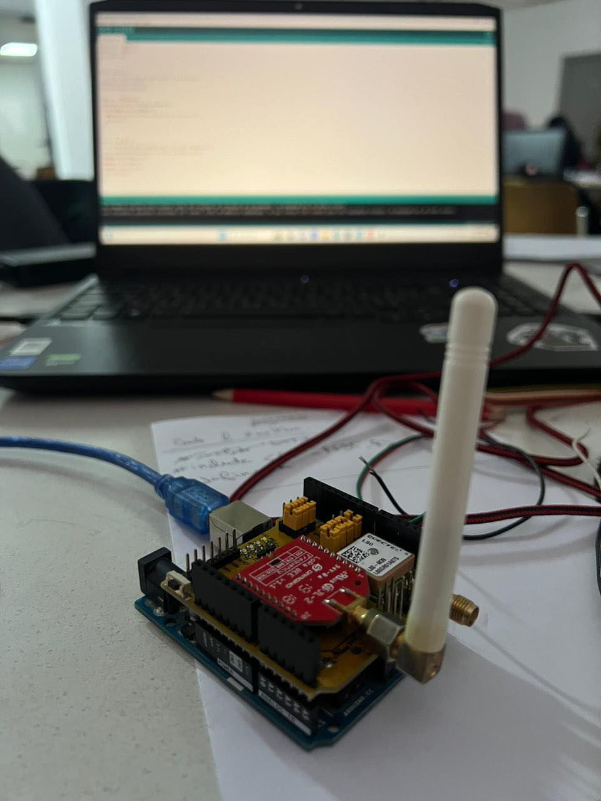
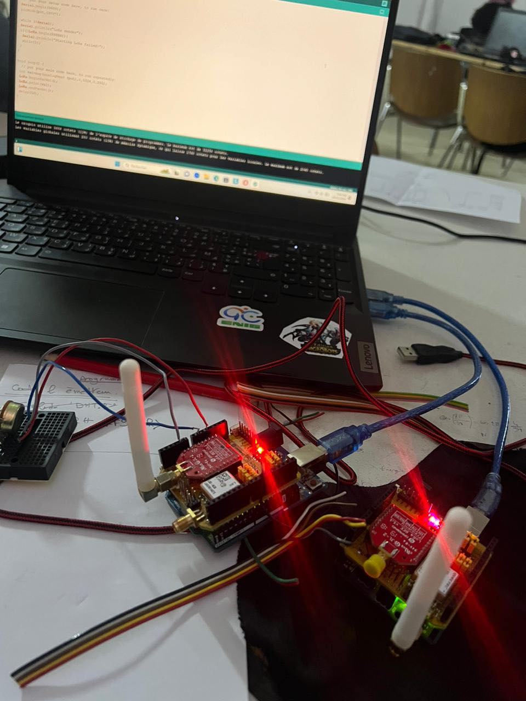

# 📡 Sensor Data Transmission via LoRa — Arduino + Potentiometer

This project **transmits data from a potentiometer** from a transmitter Arduino to a receiver Arduino using **LoRa**.  
The receiver displays the values on the serial monitor for further processing or sending to a central system.

- 🟢 **Transmitter** — Arduino reads the potentiometer and sends the value via LoRa  
- 🔵 **Receiver** — Arduino receives LoRa data and displays it on the serial monitor  

The project includes **real wiring** and photos.

---

## 🚀 Features
- Wireless transmission of analog sensor data via LoRa  
- Low power consumption and long-range communication (868 MHz)  
- Real-time display on the serial monitor  
- Compatible with other analog sensors  

---

## 🔧 How It Works

### 🟢 Transmitter
- Reads the potentiometer value on pin A0  
- Maps the value from 0–1024 to 0–10  
- Sends the value via LoRa every 50 ms  

### 🔵 Receiver
- Waits for incoming LoRa packets  
- Reads each received byte and prints it on the serial monitor  
- Measures RSSI for signal quality  

---

## 🖼️ Project Images

  

 


---

## 📂 Project Structure

```text
lora-sensor-transmission/
│── firmware/
│   ├── emetteur.ino
│   └── recepteur.ino
│
│── media/
│   ├── wiring1.png
│   ├── wiring2.png
│
│
│── docs/
│   ├── features.md
│   ├── system-architecture.md
│   └── components.md
│
│── README.md
```
---

## 🛠️ Technologies Used

- Arduino Uno 
- LoRa SX1276 / 868 MHz modules
- Potentiometer
- Arduino IDE
- C/C++
- Breadboard & jumper wires

---

## 📧 Contact
**Manar Daghsni**  
📧 manardaghsni@gmail.com  
🔗 [LinkedIn](https://linkedin.com/in/daghsni-manar)


